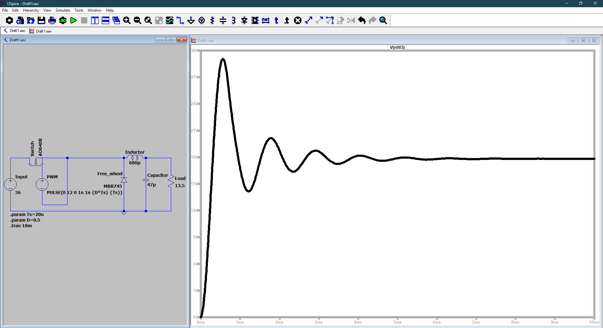
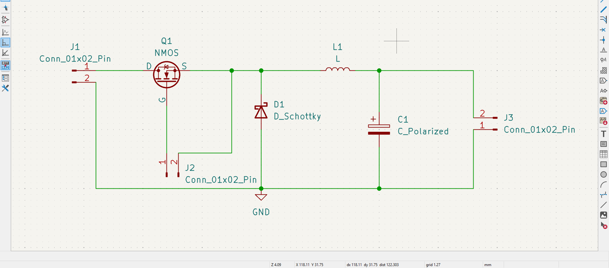
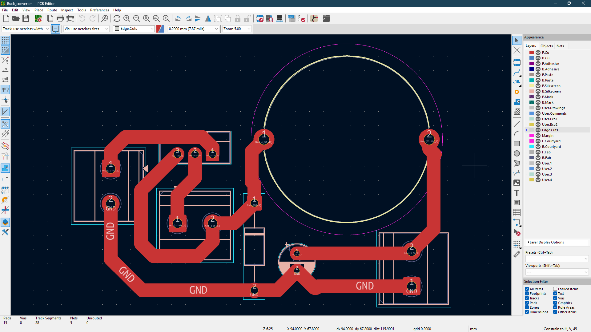
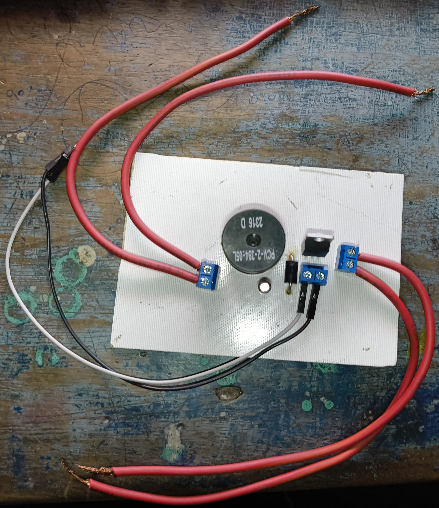
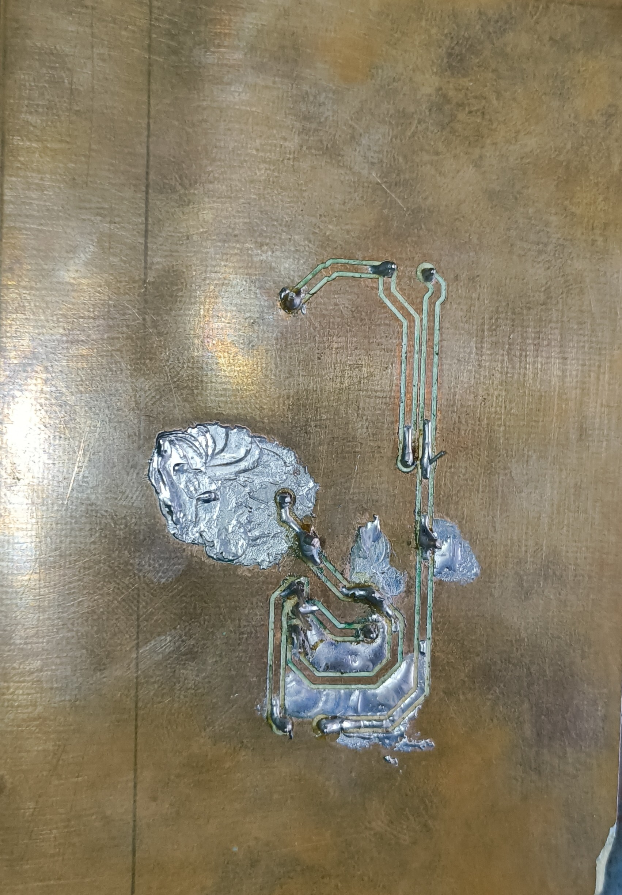
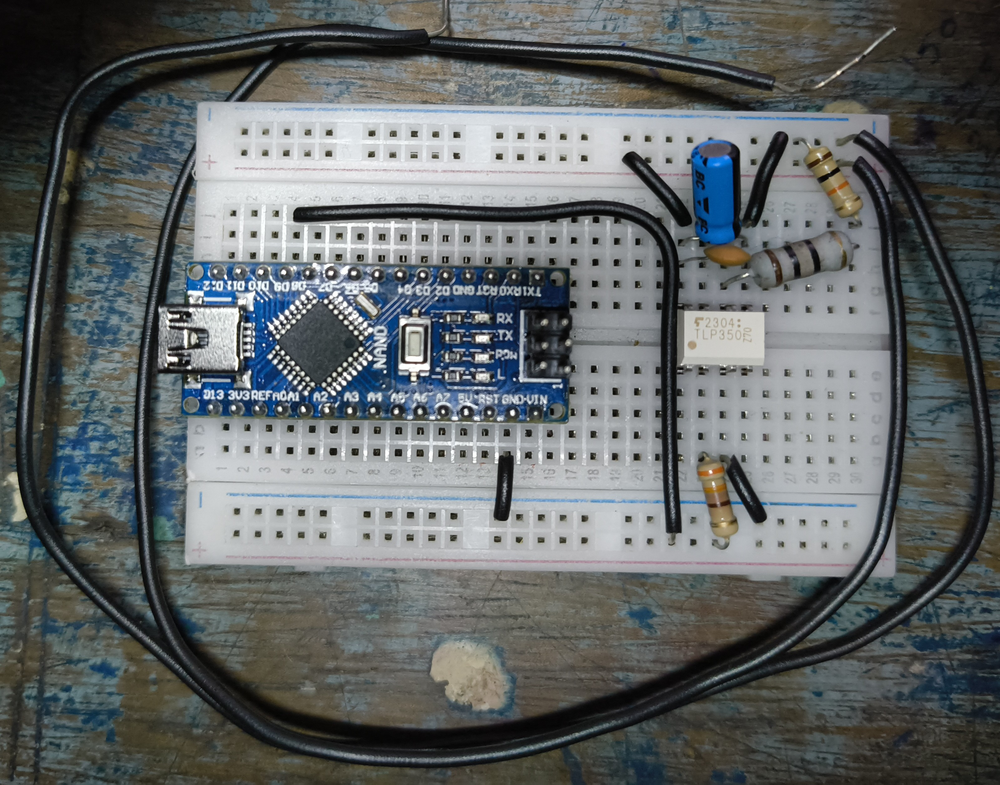
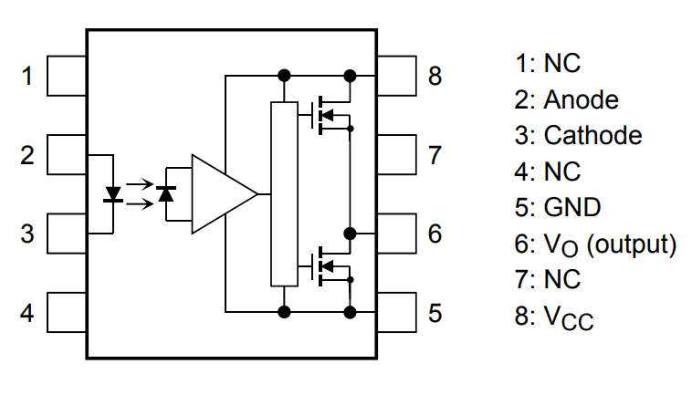

# 🔷 36V to 18V Buck Converter using PWM Control

## 📌 Overview

This project demonstrates the design and implementation of a **DC-DC Buck Converter** to step down **36V to 18V** using high-frequency PWM switching. The system integrates **power electronics, PCB design, and embedded control** using an Arduino Nano and TLP350 gate driver.

---

## 🔹 Specifications

* Input Voltage: **36V DC**
* Output Voltage: **18V DC**
* Output Power: **24W**
* Switching Frequency: **50 kHz**
* Topology: **Buck Converter**
* Control Method: **PWM (Arduino Nano)**

---

## 🔹 Block Diagram



---

## 🔹 Circuit Design



The circuit consists of:

* MOSFET switch (IRLZ44N)
* Freewheeling diode (Schottky)
* Inductor (680µH)
* Output capacitor (100µF)
* Load resistor (~13.5Ω)

---

## 🔹 PCB Design

### PCB Layout



### 3D View


The PCB is designed as a **single-layer layout** with optimized routing for power components.

---

## 🔹 Hardware Implementation

### Front View (Assembled Circuit)



### Back View (PCB Tracks)



The circuit is fabricated on a copper board and assembled using through-hole components.

---

## 🔹 PWM Control Circuit

PWM signal is generated using an **Arduino Nano** at 50 kHz and used to drive the MOSFET via a **TLP350 gate driver**.

### PWM Generation Circuit



### Gate Driver (TLP350)



---

## 🔹 PWM Code

The PWM signal is generated using Timer1 for stable high-frequency operation.

```cpp
// 50 kHz PWM on Arduino Nano (Pin 9)

void setup() {
  pinMode(9, OUTPUT);

  TCCR1A = 0;
  TCCR1B = 0;

  TCCR1A |= (1 << WGM11);
  TCCR1B |= (1 << WGM12) | (1 << WGM13);

  TCCR1A |= (1 << COM1A1);
  TCCR1B |= (1 << CS10);

  ICR1 = 319;     // 50 kHz
  OCR1A = 160;    // 50% duty cycle
}

void loop() {}
```

---

## 🔹 Design Calculations

All component values are calculated based on design requirements:

* Duty Cycle: **0.5**
* Inductor: **680µH**
* Capacitor: **100µF**
* Load Resistance: **13.5Ω**

📄 Detailed calculations available in:

```
docs/design_calculations.pdf
```

---

## 🔹 Working Principle

The buck converter operates by rapidly switching the MOSFET ON and OFF:

* When ON → Energy stored in inductor
* When OFF → Energy delivered to load via diode
* Output voltage controlled by duty cycle

---

## 🔹 Features

* Efficient DC-DC step-down conversion
* High-frequency switching (50 kHz)
* Microcontroller-based PWM control
* Isolated gate driving using TLP350
* Compact single-layer PCB design

---

## 🔹 Project Status

* ✔ Power circuit designed
* ✔ PCB designed and fabricated
* ✔ Hardware assembled
* ✔ PWM control implemented
* ⏳ Output verification in progress

---

## 🔹 Applications

* Power supplies
* Battery charging systems
* Embedded power control systems
* DC voltage regulation

---

## 🔹 Tools & Technologies

* **KiCad** – Schematic & PCB design
* **LTspice** – Circuit simulation
* **Arduino IDE** – PWM programming
* **Hardware Implementation** – Breadboard & PCB

---

## 🔹 Author

**Naraender**
